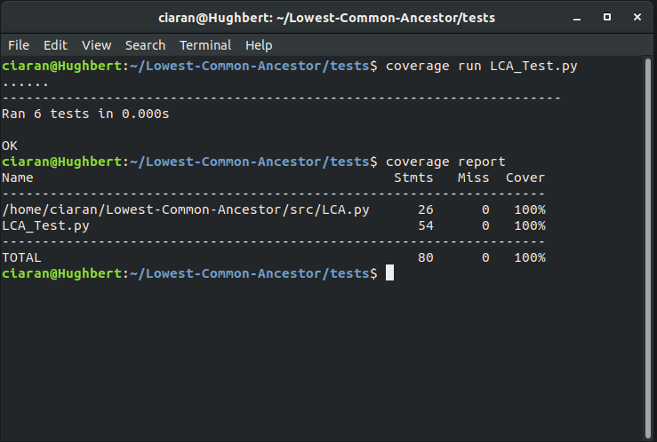

# Lowest-Common-Ancestor

A python program that gets the lowest common ancestor for a graph

# Requirements

[python](https://www.python.org/)
[pytest](https://docs.pytest.org/en/latest/)
[pytest-cov](https://coverage.readthedocs.io/en/v4.5.x/)

## Optional

Alternatively you can run the complete development environment based on the included
Dockerfile, in which case you will need to have docker installed and configured for your machine.

[docker](https://www.docker.com/)

# Testing

Pytest is used to run unit tests.
Pytests coverage plugin is used to check code coverage, as shown below.

# Docker

For ease of development and testing I have included a Dockerfile, from which you can
build a docker image that includes all the necessary dependencies. 

After cloning the repo and navigating to the Lowest-Common-Ancestor root directory, build
the docker image using the command:

`docker build -t python_dev .` this builds a docker image with the tag python_dev from the 
included dockerfile.

Once this is completed successfully you can run the container using the command:
`docker run -i -t --name python python_dev` This will create an interactive container called python from the python_dev image we just made.

After running the container you should be greeted with a bash shell and instructions on how to run tests and check for code coverage.
